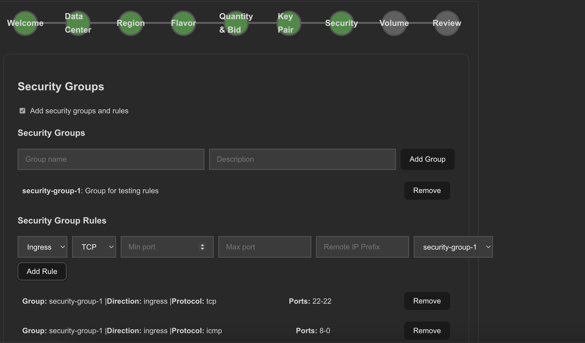

# 🐍 React Frontend UI

# Introdution

A cost-effective, flexible VM provisioning solution built on a bidding-based model, designed for private cloud scalability. Offers raw VM access with volumes, security, and SSH controls—perfect for enterprises, developers, and internal cloud teams.
---

# 🖥️ VM on Spot Platform - React UI

This is the front-end for the VM provisioning platform, built using React.js.

## 🛠️ Setup Instructions

### 1. Prerequisites
- Node.js (v16+)
- npm (v8+) or yarn

### 2. 2. Clone Repo and install dependencies:
```bash
git clone <repo>
cd vm-allocater-ui

npm install
# or
yarn install
```

### 3. Run Application
```bash
npm run dev
```

### 4. Demo Link
[Hackathon Demo ( Presentation + UI )](https://drive.google.com/file/d/1dVSs7JulgWLlKyFMi365EEU2rXjaVa88/view?usp=sharing)

### Screenshots





